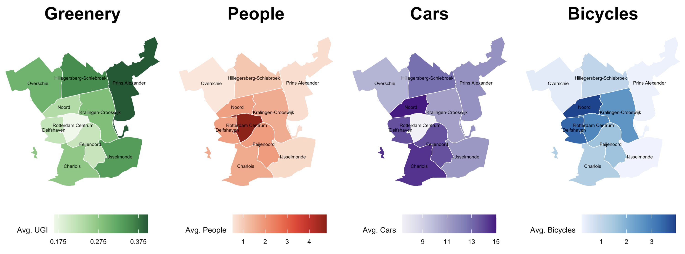
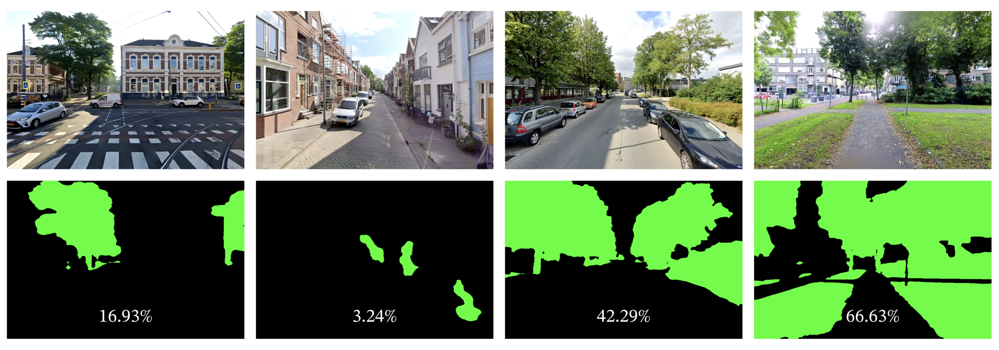

# The View From The Street: How Urban Environmental Features Shape Housing Prices in Rotterdam

> This repository contains the code and (some of the) data for my master's thesis project. The project is about the relationship between urban environmental features, as observed from street view imagery, and housing prices in Rotterdam. The thesis text is available [here](https://linuswolff.github.io/ViewFromTheStreet/thesis_text.pdf).

---

**Abstract:** This study investigates the impact of urban environmental factors on residential property prices in Rotterdam, leveraging advanced computer vision techniques to extract features from street-level imagery. We extend traditional hedonic pricing models by incorporating visual characteristics of the urban environment. Analyzing 6,691 property listings and over 200,000 street view images, we employ semantic segmentation and object detection models to quantify urban greenery, pedestrian presence, and transportation infrastruc- ture. Our methodology compares linear hedonic pricing models with non-linear Random Forest approaches across multiple spatial scales. Results demonstrate that incorporating image-derived environmental features significantly improves the predictive accuracy of property valuation models, with Random Forest models consistently outperforming traditional linear methods. The Urban Greenery Index exhibits the strongest positive in- fluence on property values for houses but the weakest for apartments, while the presence of bicycles shows the largest overall positive effect. We observe non-linear relationships and threshold effects in the impact of environmental factors, highlighting the complexity of urban housing valuation. This research offers a novel framework for integrating visual environmental data into property valuation models, providing valuable insights for urban planning and real estate economics.

**Keywords:** computer vision, hedonic pricing models, random forest, real estate valuation, street-view imagery, urban environmental factors

---

  
   
  <em>Distribution of image-derived environmental features across Rotterdam.</em>

...

  
   
  <em>Example Street View Images: Valid (top) and Invalid (bottom).</em>

...

  
   
  <em>Original Images (Top) and their Segmented Masks (Bottom) reveal the extent of greenery in different urban settings. The percentages represent the Urban Greenery Index (UGI) for each scene.</em>

...

  
   
  <em>Visual representation of our Object Detection results, showcasing bounding boxes highlighting People (yellow), Cars (red), and Bicycles (blue).</em>

...

  
   
  <em>Stylized visualization of the Spatial Association (with a chosen radius of 250m).</em>

...
