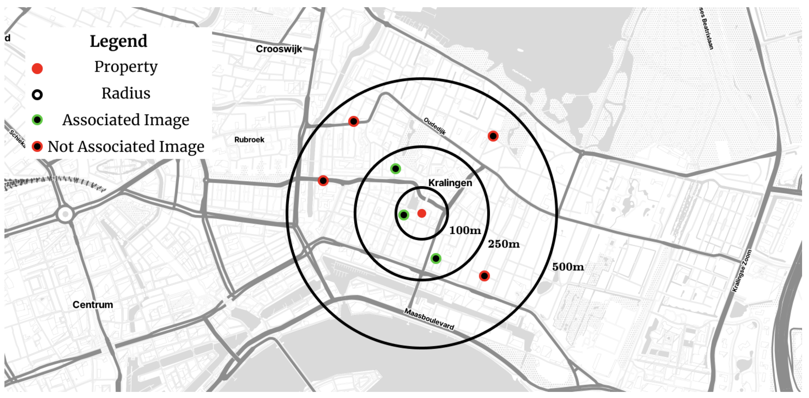

# The View From The Street: How Urban Environmental Features Shape Housing Prices in Rotterdam

This repository contains the code and (some of the) data for my master's thesis project. The project is about the relationship between urban environmental features, as observed from street view imagery, and housing prices in Rotterdam. The thesis text is also available [here](./thesis_text.pdf).

...

...

...

...

...